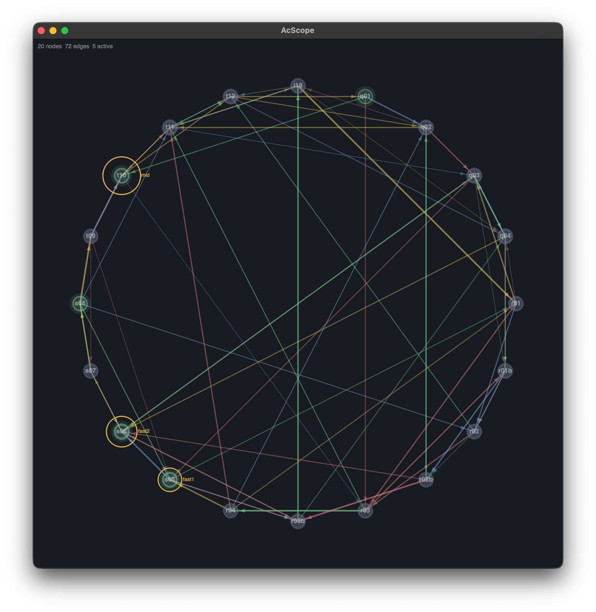

# Accrete

A graph-based system for SuperCollider , sound as behaviour in a dynamic network.



Compose by building a graph of generative sound processes.

## Overview

Accrete cexplores **graph topology and traversal**. Nodes are generative synths, edges are weighted connections, and walkers traverse the graph activating sounds. 

## Usage

```supercollider
s.boot;

// Load runtime libraries
a = Accrete(thisProcess.interpreter);

// Create graph with bus routing
g = AcGraph(2, 0);
g.initRouting(\master);

// Add nodes (preset behaviours or your own functions)
g.addNode(\drone, a.behaviours[\drone], (freq: 55, amp: 0.3));
g.addNode(\grain, a.behaviours[\grain], (freq: 800, density: 12, amp: 0.2));
g.addNode(\pulse, a.behaviours[\pulse], (rate: 4, freq: 200, amp: 0.25));

// Connect with typed, weighted edges
g.connect(\drone, \grain, 0.7, \succession, Dictionary[\freq -> \freq]);
g.connect(\grain, \pulse, 0.5, \contrast);
g.connect(\pulse, \drone, 0.3, \variation);

// Walk the graph, sound transitions as the walker moves
t = AcTraversal(\walk, g, { rrand(4.0, 8.0) }, fadeTime: 3);
t.walk(\drone);

// Add reverb to the whole graph
g.addProcess(\verb, a.processing[\verb]);
g.setProcess(\verb, \mix, 0.4, \room, 30);

// Visualize
g.scope([t]);

// Stop
t.stop; g.free;
```

## System

### Classes

| Class | Role |
|-------|------|
| **Accrete** | Entry point. Loads `.scd` libraries at runtime. |
| **AcGraph** | Core engine. Nodes, edges, event log, bus routing, processing chain. |
| **AcNode** | Wraps an Ndef. Activation/deactivation lifecycle, param tracking. |
| **AcEdge** | Weighted, typed connection with optional param mapping and decay. |
| **AcTraversal** | Independent walker with its own Routine. Recency-biased edge selection. |
| **AcGrowth** | Growth models: preferential attachment, random, small-world rewire, edge decay. |
| **AcObserver** | Server-side analysis (SendReply) → language-side response. Feeds back into graph. |
| **AcEvent** | Immutable causality record. Every action is logged. |
| **AcScope** | Live GUI visualization with force-directed layout and draggable nodes. |

### Runtime

| File | Contents |
|------|----------|
| **Behaviours.scd** | 8 synthesis behaviours: drone, grain, pulse, shimmer, rumble, breath, bell, crackle |
| **Processing.scd** | 6 filter effects: verb, fold, delay, filter, shift, crush |
| **Observers.scd** | 6 feature extractors: amplitude, pitch, centroid, flatness, onsets, zeroCrossing |
| **GrowthModels.scd** | Convenience wrappers around AcGrowth class methods |

### Nodes & Edges

Nodes wrap Ndefs. Any `{|args| UGen}` function works as a behaviour, use the presets or write your own inline. Edges are directed, weighted, and typed (`\succession`, `\contrast`, `\variation`, `\transformation`). Edges can carry a **paramMap** that propagates parameter values when a walker crosses them.

### Traversal

A walker is a Routine that moves through the graph, activating nodes and optionally deactivating them on departure. Edge selection is weighted by edge weight and modulated by **contrast bias**, recently visited nodes are penalized. Multiple walkers can run simultaneously for polyphonic textures.

### Routing & Processing

```supercollider
g.addProcess(\verb, {|in, mix = 0.3| FreeVerb2.ar(in[0], in[1], mix, 0.8, 0.5) });
g.addProcess(\crush, {|in, bits = 12| in.round(2.pow(bits.neg)) });
g.setProcess(\verb, \mix, 0.5);
g.removeProcess(\crush);
```

Without `initRouting`, nodes play directly to hardware output (backward compatible).

### Growth

```supercollider
AcGrowth.preferentialAttachment(g, \newNode, myFunc, (freq: 440), 2);
AcGrowth.smallWorldRewire(g, 0.1);
AcGrowth.decayEdges(g, 1.0);  // weaken edges, remove dead ones
```

### Visualization

```supercollider
s = g.scope([walker1, walker2]);
s.layoutForce(120); 
```

## Custom Behaviours

Any UGen function works. No presets required:

```supercollider
g.addNode(\fm, {|carrier = 200, ratio = 2, index = 3, amp = 0.2|
    PMOsc.ar(carrier, carrier * ratio, index) * amp ! 2
}, (carrier: 300));

// Add live
g.addNode(\wobble, {|freq = 60, rate = 3, amp = 0.15|
    LFTri.ar(freq) * SinOsc.kr(rate).range(0.2, 1.0) * amp ! 2
});
g.connect(\fm, \wobble, 0.6);

// Grow with a custom behaviour
AcGrowth.preferentialAttachment(g, \clicks, {|rate = 8, amp = 0.1|
    Impulse.ar(rate) * SinOsc.ar(4000) * amp ! 2
});
```

## Examples

In `examples/` 

| # | What | How |
|---|------|---------------------|
| 01 | Triangle | Minimal 3-node cycle with param mapping |
| 02 | Two Walkers | Polyphonic traversal, slow layering + fast contrast |
| 03 | Star | Central hub with satellites |
| 04 | Growing Network | Rapid growth to 50+ nodes with 3 walkers and live scope |
| 05 | Decay & Regrow | Self-reshaping network with edge decay and regrowth |
| 06 | Observer Feedback | Amplitude analysis drives network growth |
| 07 | Processing Chain | Master bus reverb, fold, delay, add/remove live |
| 08 | Custom Behaviours | Entirely hand-written synths, no presets |

## Tests

```supercollider
TestAcGraph.run;
TestAcGrowth.run;
TestAcTraversal.run;
```
